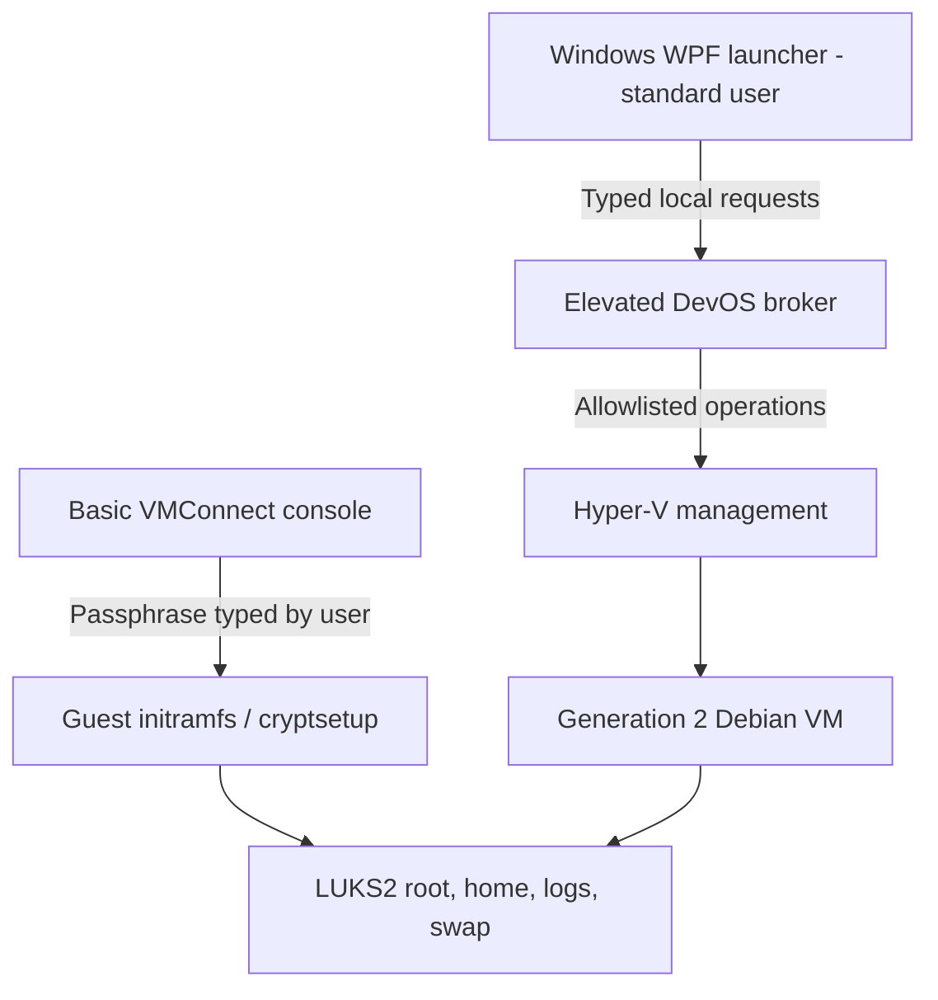

# DevOS Architecture

Status: Phase 0 proposal for review. No launcher, VM, or encryption has been implemented or verified yet.

## Machine Assessment

Read-only inspection on 2026-09-25 found:

| Property | Observed value |
| --- | --- |
| Host | Windows 11 Pro 25H2, x64, build 26200 |
| Processor | Intel Core i5-1145G7, 4 cores / 8 logical processors |
| Physical memory | Approximately 15.75 GiB usable |
| C: storage | Approximately 237.4 GiB total / 98.4 GiB free |
| HypervisorPresent | True |
| Hyper-V management | No vmms service or Hyper-V PowerShell module returned |
| CPU virtualization / SLAT flags | Both returned false; inconclusive with a hypervisor active |

Windows edition is suitable for Hyper-V. These observations do not prove that the full Hyper-V feature is installed or that a DevOS VM can boot. Phase 1 must inspect feature state, permissions and reboot requirements, then perform an actual boot test. Do not tell the user to disable VBS or Windows security based on these CPU flags.

Start with 2 vCPUs, 4 GiB static RAM and a 48 GiB fixed VHDX. Recheck space before creation and preserve at least 25 GiB host free space. A 64 GiB disk is optional after rechecking available space; 128 GiB is unsuitable on this drive now. Backups need a separate capacity check and preferably another drive. Static RAM avoids dynamic-memory complexity; reserve adequate RAM for Windows and development tools.

## Technology Decisions

| Component | Proposed choice | Reason / tradeoff |
| --- | --- | --- |
| Launcher | C# / WPF / .NET 10 LTS | Mature native Windows integration; no embedded browser needed. Measure startup and memory rather than promising a footprint. |
| Hypervisor | Microsoft Hyper-V, Generation 2 VM | Available for this Windows edition; established VM lifecycle and VHDX tooling. |
| Linux | Debian 13 stable, amd64 | Stable package base, standard kernel and cryptsetup tooling. Pin the actual installer version and verified digest during implementation. |
| Desktop | XFCE in Phase 4 | Modest resource requirements and straightforward customization. Phase 1 only needs a minimal Linux boot. |
| Storage | Fixed VHDX with GPT | Predictable host allocation; allocation metadata still exists. VHDX alone provides no encryption. |
| Encryption | LUKS2 / dm-crypt with ext4 inside | Established encryption and recovery tooling; encrypt root, home, logs and persistent swap. |
| Console | Basic VMConnect session | Boot-time input and desktop display without installing a network remote-desktop service. |

WinUI 3 is viable but adds Windows App SDK deployment considerations without a requirement that warrants it here. Tauri adds a WebView and a Rust/JavaScript boundary. WPF is the initial maintainability choice, not a claim that it is inherently more secure.

WHP is a virtualization API, not a complete VM manager. QEMU with WHPX is a possible future backend for hosts without full Hyper-V, but requires separate device, display and lifecycle validation. WSL2's developer integration and lifecycle make it a poor default for this dedicated encrypted desktop. Do not build either fallback in Phase 1.

## Components And Trust Boundaries



The Windows host remains trusted. A compromised host can observe console input or VM memory. Entering the passphrase in the guest avoids routine handling by DevOS's launcher, but does not bypass host control.

## Disk And Encryption Design

One VHDX contains an EFI System Partition, a small unencrypted /boot partition, and a LUKS2 partition containing LVM volumes for ext4 root and swap. /home, application data, temporary persistent files and logs live under encrypted root. Use tmpfs for appropriate volatile paths. Disable guest hibernation and plaintext crash dumps. No unencrypted data partition or host-backed swap.

The EFI and /boot partitions contain boot software only, never passphrases, keyfiles, user documents or secrets embedded in initramfs. This is an explicit exception to filesystem encryption. VHDX structure, LUKS metadata, boot software, disk size and modification times remain visible. Encryption does not hide the existence of DevOS.

Use cryptsetup LUKS2 with AES-XTS and Argon2id key derivation, validated against the installed distribution tooling. Calibrate Argon2 memory/time cost inside the 4 GiB guest and confirm early boot can unlock it without exhausting memory. Record non-secret parameters and verify LUKS version, cipher, keyslots and filesystem placement. Disable discard passthrough initially to limit allocation leakage. AES-XTS does not authenticate arbitrary ciphertext or provide rollback protection.

Keep Secure Boot enabled with Hyper-V's Linux-compatible Microsoft UEFI Certificate Authority template. Verify the selected Debian installer and installed guest boot successfully with the actual host firmware trust configuration. Do not silently disable Secure Boot if boot fails. Ordinary Secure Boot must not be described as authenticating all mutable /boot or initramfs content; stronger measured or unified-kernel boot is future work.

## Setup, Boot And Unlock

1. Check host requirements, space and virtualization tooling. Request elevation only for host changes. Feature enablement and any reboot are visible setup operations.
2. Create an owned VM and empty VHDX with restrictive host ACLs, checkpoints disabled and safe shutdown policy.
3. Obtain Debian installation media and verify its digest against an authenticated Debian checksum manifest. Record image provenance; attach only trusted media.
4. Install the guest. In Phase 2, collect encryption and recovery credentials inside the guest installer/console. Never embed secrets in unattended installer files, command arguments or host logs.
5. Validate the installed storage layout and isolation configuration, then power off and verify the off-state checks in security.md.
6. On subsequent launch, start the VM and open the basic console. Debian's initramfs requests the LUKS passphrase. Wrong credentials leave the encrypted root closed.
7. After root unlock, boot to the guest login screen and XFCE when available. Disk unlock and Linux account login are distinct authentication steps in the first secure version.

The launcher's initial Unlock action starts this console flow; it does not contain a password box. Fully automated secret entry is deferred until a separately reviewed design exists. Phase 1 uses disposable test data and may have an unencrypted guest; it must clearly report encryption as unconfigured.

## Lifecycle And Truthful Status

Track VM power, encryption provisioning, configuration compliance and guest readiness separately. Hyper-V reporting Running does not prove that LUKS is unlocked or the desktop ready. Phase 1 reports VM power only; readiness is unknown until an appropriate guest signal exists.

| State | Meaning |
| --- | --- |
| UNINITIALIZED | No complete DevOS installation |
| OFF / UNVERIFIED | VM off, but encryption or configuration has not passed verification |
| LOCKED | Verified encrypted installation, VM Off, no known saved-memory state or disallowed checkpoints; claim limited to the documented threat model |
| STARTING | Powering on, awaiting unlock, or booting; guest readiness shown separately |
| RUNNING | VM running; this alone makes no statement about desktop readiness |
| LOCKING | Console hidden/closed and guest shutdown requested; keys may still be live |
| SHUTTING_DOWN | Graceful guest shutdown in progress |
| ERROR / UNKNOWN | Required state cannot be established; never infer Locked |

Cryptographic Lock closes the managed console immediately, requests guest shutdown, waits for Hyper-V Off, and reconciles saved-state/checkpoint policy before showing Locked. Closing a console is not encryption. External console windows may remain; desktop/session lock must also be considered when implementing immediate screen privacy.

Use Linux Hyper-V shutdown integration for graceful shutdown. Allow applications to save where supported; do not promise that unsaved work will survive. On timeout, show the failure and offer explicit forced power-off with a data-loss warning. Do not automatically force off or save the VM. A crash may require guest filesystem recovery on next boot.

Set automatic VM start to Nothing and automatic stop to ShutDown. Disable all checkpoints initially, including automatic checkpoints, and do not use Save or Pause as lock operations. Host sleep/hibernate is not a lock guarantee. Later coordinate host session lock and sleep with shutdown, but report unsuccessful or interrupted shutdown honestly. Restarting the launcher reconciles actual VM state; a launcher crash does not shut down the VM.

## Host/Guest Communication

Initially use Hyper-V management for power/state and only necessary built-in guest integrations such as shutdown and heartbeat. Disable Guest Service Interface file copy. Heartbeat is health information, not proof of encryption or authentication. No SSH server, RDP server, host filesystem mount or general remote command endpoint is needed.

A later guest agent may use Hyper-V sockets if Linux/Windows compatibility is demonstrated. Limit the protocol to versioned, bounded status and lock requests with per-VM authorization and replay protection where applicable. Treat guest responses as untrusted. Do not introduce an agent or custom secret-unlock transport in Phase 1. No localhost TCP listener as an implicit fallback.

## Network Modes

| Mode | Implementation | Claim |
| --- | --- | --- |
| Offline | Disconnect every virtual NIC and verify no other network/passthrough device | No guest network path through configured adapters |
| Isolated | Dedicated Hyper-V private switch for this profile, no host adapter, NAT or uplink; audit membership | Guest cannot communicate with host/uplink through this switch; other attached VMs would weaken isolation |
| NAT Internet | Dedicated internal switch and WinNAT with controlled address allocation and firewall policy | Internet permitted; NAT alone does not block host or LAN access |

Offline is the default after provisioning. Installation/updates may explicitly use NAT. Phase 1 may use the existing Default Switch for an explicitly selected installation network, labeled as ordinary NAT connectivity with host/LAN reachability, never as Isolated. The stronger dedicated NAT backend arrives in Phase 3.

For the dedicated NAT mode, select a non-conflicting subnet and configure guest addresses; WinNAT does not supply a full DHCP service. Scope firewall rules to the DevOS interface/profile, deny unsolicited inbound traffic, and explicitly constrain host/LAN destinations where feasible. Test IPv4, IPv6, DNS and routing; otherwise disable unimplemented guest IPv6 paths. Do not modify unrelated host networking or existing WSL/container NAT instances. Failed policy application leaves adapters disconnected and the mode in Error. Network mode transitions must read back effective settings.

## Clipboard And File Transfer

Default clipboard mode is Off. Use Basic VMConnect without enhanced-session redirection, xrdp, drive redirection or clipboard agents. VMConnect can expose an explicit clipboard-typing action even without automatic synchronization; test it and document the distinction. DevOS must not call that action automatically. Guest applications may use their own clipboard internally.

Text Only and Enabled are future opt-in modes requiring a reviewed transport, direction controls, size limits and clear consent. Do not expose working-looking toggles before implementation. Clearing a clipboard cannot retract clipboard history or data already copied by another application.

File sharing stays disabled. A future import gateway can construct a read-only ISO containing only explicitly selected files, attach it to this VM, then detach it after guest import. Host staging already contains those imported files and may leave recoverable remnants; deletion is not secure erasure. Exports need separate guest selection, destination consent and a bounded transfer protocol. Warn that exported plaintext is outside DevOS encryption. Never automatically mount the private VHDX on Windows or expose a host directory wholesale.

## Privilege And Configuration

WPF runs as the current standard user. Begin with a short-lived UAC-elevated broker for VM mutations; consider a service only when unattended lock coordination needs it. Do not add the user to Hyper-V Administrators as a convenience, since that grants broader management rights.

The broker accepts a small typed operation set over a local named pipe, with caller SID/session checks, restrictive ACLs, remote clients rejected, bounded messages and fixed operation timeouts. It manages only registered DevOS VM IDs. Install broker binaries and fixed scripts in an administrator-controlled location. Normal-user configuration cannot authorize arbitrary VM IDs, paths, executable names or shell programs.

Use Hyper-V CIM/WMI APIs or fixed PowerShell scripts with typed parameter binding. Canonicalize paths, reject path traversal and reparse-point escapes, validate sizes and ownership, and protect against concurrent lifecycle requests. VMConnect access for a standard user must be tested with per-VM connection authorization; do not grant blanket admin access as a workaround.

Use versioned JSON for non-secret configuration: VM ID, CPU count, RAM MiB, disk GiB, managed storage location, encryption provisioning status, clipboard mode, transfer policy, auto-lock duration, network mode and UI preferences. Keep desired policy separate from observed state. Privileged resource ownership lives in broker-controlled metadata. Configuration is never proof that encryption is present.

Store VM assets outside the source tree under a restricted per-profile directory in ProgramData. Exclude them from indexing and uncontrolled cloud synchronization where applicable. Host ACLs help against other users but do not prevent an administrator from copying or deleting the encrypted disk. Do not store passwords, volume keys or recovery keys in configuration or Windows Credential Manager for the initial design.

## Recovery And Backups

Use a strong user passphrase and an independently generated high-entropy recovery secret in a second LUKS2 keyslot. These are alternative unlock methods, not two-factor authentication. Generate and display recovery material inside the guest. Require the user to confirm it can unlock before setup is considered recoverable. Saving or printing it on Windows is an explicit export with host exposure, never an automatic operation.

Back up only after clean shutdown: copy the closed encrypted VHDX plus non-secret configuration and a versioned checksum manifest. Exclude saved memory, credentials and secret logs. Checksums detect accidental corruption, not malicious replacement; add authenticated backup packaging using established tooling when that feature is built. Keep multiple backup generations and test a restore to a separate VM with networking disconnected.

A protected LUKS header backup can recover metadata damage but not lost data. Old headers can restore revoked keyslots; old full-disk backups may still accept old passwords. Document retention and key-rotation implications. Never automatically keep recovery material beside its disk. Loss of all valid credentials can make data permanently inaccessible. TPM/biometric convenience unlock is deferred and must not silently replace these recovery requirements.

## Repository And Delivery

The working directory already has Git metadata with no commits. Phase 0 adds documents only; do not reinitialize Git or alter its remote.

```text
docs/architecture.md
docs/threat-model.md
docs/security.md
launcher/DevOS.Launcher/       # WPF UI, introduced in Phase 1
launcher/DevOS.Broker/         # constrained privileged operations
virtualization/DevOS.HyperV/  # implementation and small backend contract
guest/provisioning/           # reproducible installation inputs
guest/security/               # encrypted layout and hardening checks
guest/desktop/                # XFCE configuration in Phase 4
scripts/                     # explicit development/setup commands
tests/                       # lifecycle, policy, integration verification
```

Add README, .gitignore and solution/project files in Phase 1. Ignore VM disks, installer media, saved state, local config, recovery material, credentials, build output and logs. Choose a license explicitly before publication; do not assume one. Avoid empty placeholder projects for future features.

Phase 1 acceptance: build a WPF launcher; show reliable compatibility results; create exactly one owned disposable VM from verified media; open its console; boot Debian; gracefully stop it; reconcile state on app restart; provide useful errors for missing Hyper-V and denied access. Unit-test validation and state reconciliation, then perform real Hyper-V integration tests. Report untested hardware behavior explicitly.

Phase 2 acceptance: rebuild the disposable guest with encrypted root, verify cold unlock/recovery, wrong passphrase handling and shutdown relock before any real private data is used. Phase 3 completes enforced network modes and isolation testing. Phase 4 adds XFCE branding and a small application set. Phase 5 implements auto-lock, backups, recovery UX and transfers. Phase 6 covers installer, reliability and performance. Basic safe logging, recovery design and disabled sharing apply from the beginning, even when their richer UX arrives later.

## References

- [Microsoft Hyper-V installation and supported Windows editions](https://learn.microsoft.com/en-us/windows-server/virtualization/hyper-v/get-started/Install-Hyper-V)
- [Hyper-V hardware requirements](https://learn.microsoft.com/en-us/windows-server/virtualization/hyper-v/host-hardware-requirements)
- [.NET support policy](https://dotnet.microsoft.com/en-us/platform/support/policy)
- [Debian releases](https://www.debian.org/releases/)
- [Microsoft checkpoint behavior](https://learn.microsoft.com/en-us/windows-server/virtualization/hyper-v/checkpoints)
- [Cryptsetup security and recovery FAQ](https://gitlab.com/cryptsetup/cryptsetup/-/wikis/FrequentlyAskedQuestions)
- [Debian cryptsetup integration](https://cryptsetup-team.pages.debian.net/cryptsetup/README.Debian.html)

These sources inform the proposal. They do not replace validation on this machine and the pinned guest image.
